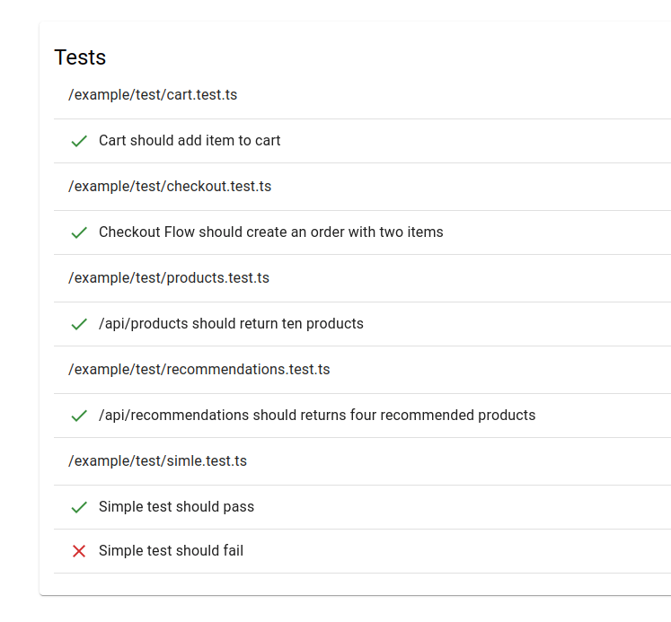
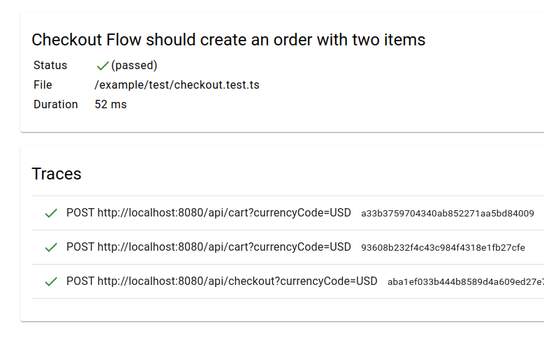
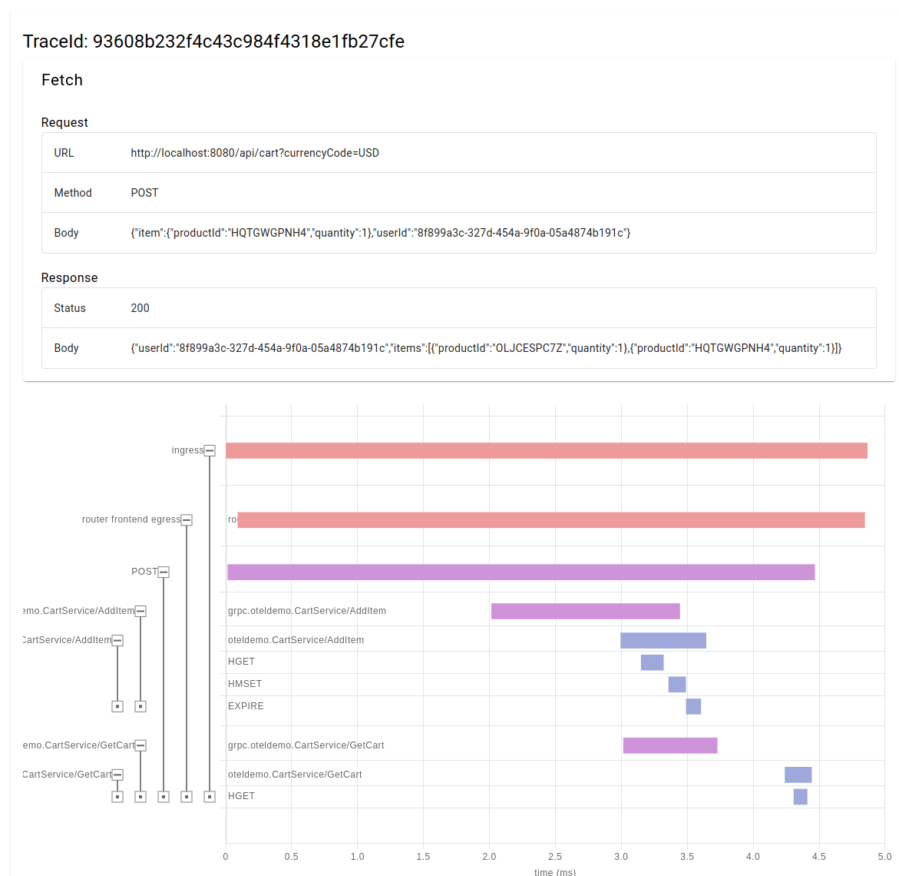
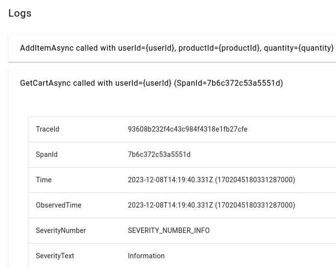

Observable API testing library using OpenTelemetry for Jest.

# Tobikura

Tobikura empowers API testing by visualizing API traces and logs from OpenTelemetry.

# Screenshots

Tobikura generates an HTML report for Jest results.  
See below for screenshots of the report:

* Executed Tests List  
    
* Test result page  
    
* Trace of the Test  
    
* Logs for the Trace of the Test  
    


# Installation

Choose one of the following methods to install Tobikura based on your testing needs:

## 1. Setup with example tests

1. Initialize a new directory using npx:
    ```
    mkdir my_test_directory && cd my_test_directory
    npx tobikura@latest
    ```
2. Review the example tests in the generated `README.md`:
    ```
    cat README.md
    ```
3. Once you're familiar, remove the `example` directory and begin crafting your own tests:
    ```
    npm run test
    ```

## 2. Integrate with existing tests

1. Modify `jest.config.js` to use Tobikura
    ```js
    module.exports = {
      // ... other configurations
      testEnvironment: "tobikura/jest/nodeEnvironment",
      reporters: [
        "default",
        ["tobikura/jest/reporter", { output: "results/report.html" }],
      ],
    };
    ```
2. Update your OpenTelemetry endpoint to use Tobikura:
    If you are using the OpenTelemetry Collector, modify its settings as shown below:
    ```yml
    exporters:
      otlphttp/local:
        endpoint: http://host.docker.internal:3000 # Default port of Tobikura's server
    
    service:
      pipelines:
        traces:
          exporters: [otlphttp/local]
        logs:
          exporters: [otlphttp/local]
    ```

# How to Use

## Make Observable

To get HTML report visualizing API traces, no modifications to your Jest code are required.

```ts
describe("Awesome test", () => {
  it("should pass", async () => {
    const response = await fetch(`http://localhost:8080/api/cart`);
    expect(response.status).toBe(200);

    const body = await response.json();
    expect(body.items.length).toBe(0);
  });
});
```
The code above produce an HTML report illustrating a trace for the requested endpoint (`http://localhost:8080/api/cart`).

## Test OpenTelemetry's Spans

In addition to the HTML output, Tobikura offers a convenient method for testing OpenTelemetry's spans.
With `waitForSpan` function, you can get a span matching your needs.

```ts
describe("Awesome test", () => {
  it("should creates OpenTelemetry's span", async () => {
    const response = await fetch(`http://localhost:8080/api/products`);
    expect(response.status).toBe(200);

    const span = await waitForSpan(response, {
      name: "oteldemo.ProductCatalogService/ListProducts",
      resource: {
        attributes: {
          "service.name": "productcatalogservice",
        },
      },
      attributes: {
        "app.products.count": gte(5),
        "rpc.system": /grpc/,
      }
    })
    const productsCount = span.attributes.find(attr => attr.key === "app.products.count")
    expect(productsCount?.value?.intValue).toBe(10)
  });
});
```
The code above waits for a span that satisfies the following conditions and then compares it using the `expect` statement
* `name` is `oteldemo.ProductCatalogService/ListProducts`
* `service.name` in resource is `productcatalogservice`
* `app.products.count` attribute is greater than or equal to `5`
* `rpc.system` attribute matches `/grpc/`
