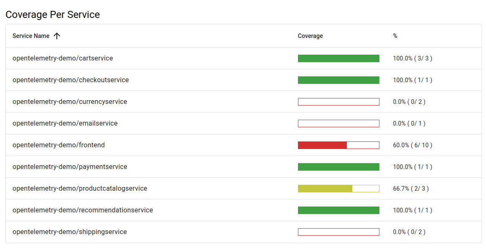

# Observable Integration Testing using OpenTelemetry on top of Jest.

Echoed empowers Integration testing, aka API testing, by providing visualizations of API traces and logs through OpenTelemetry.

# Features
Echoed enhances your testing experience with the following features:

* **Effortless Test Troubleshooting**: Quickly identify issues in failed tests by visualizing OpenTelemetry's traces and logs.
* **Coverage Analysis**: Gain insights into the coverage of your API endpoints based on OpenAPI or Protocol Buffers specifications.
* **Detect Propagation Leaks**: Uncover spans that don't propagate OpenTelemetry's context to their children.
* **Validate Spans**: Validate span's fields, such as SQL or requests going outside.
* **CI-Friendly**: Integrates with CI without relying on external services.
* **IDE Debugging**: Debug your tests in your preferred IDE, leveraging Jest's built-in debugging capabilities.
* **Code Compatibility**: No need to modify your existing Jest tests.
* **Parallel Execution**: Boost by executing tests in parallel with Jest.

# Screenshots

Echoed generates HTML that visualizes OpenTelemetry traces for each request in tests.  
Explore the screenshots below to see how it looks:

* Trace and logs of the Test  
    
    
* Coverage per service  
    
* List of executed tests  
    


# Installation

Echoed offers two installation methods, choose one that suits your needs:

## 1. Create a New Directory with Example Tests

1. Initialize a new directory using npx:
    ```bash
    mkdir my_test_directory && cd my_test_directory
    npx echoed@latest
    ```
2. Review the example tests and run them by following instructions in the generated `README.md`:
    ```bash
    cat README.md
    ```
3. Run test:
    ```bash
    npm run test
    ```
4. Once you're familiar, remove the `example` directory and begin crafting your own tests:
    ```bash
    rm -rf ./example
    ```

## 2. Integrate with Existing Tests

1. Update Jest configuration for Echoed  
    Modify your `jest.config.js` to include Echoed in `testEnvironment` and `reporters`:
    ```js
    module.exports = {
      // ... other configurations
      testEnvironment: "echoed/jest/nodeEnvironment",
      reporters: [
        "default",
        "echoed/jest/reporter"
      ],
    };
    ```
2. Create `.echoed.yml`.  
    To integrate Echoed, create a configuration file named `.echoed.yml`.  
    The minimal required option is `output`, specifying where to write the result. Refer to the [Configuration](#Configuration) section for other options.  
    
    For example:
    ```yml
    output: "report/result.html"
    ```
3. Update your OpenTelemetry endpoint to send data to Echoed.  
    If you are using the OpenTelemetry Collector, modify its settings as shown below:
    ```yml
    exporters:
      otlphttp/local:
        endpoint: http://host.docker.internal:3000 # Default port of Echoed is 3000
    
    service:
      pipelines:
        traces:
          exporters: [otlphttp/local]
        logs:
          exporters: [otlphttp/local]
    ```

# How to Use

### Make Tests Observable

To generate an HTML report visualizing API traces, no additional code is needed.  
Simply write your Jest tests as usual.

```ts
describe("Awesome test", () => {
  it("should pass", async () => {
    const response = await fetch(`http://localhost:8080/api/cart`);
    expect(response.status).toBe(200);

    const body = await response.json();
    expect(body.items.length).toBe(0);
  });
});
```
The code above produces an HTML report illustrating a trace for the requested endpoint (`http://localhost:8080/api/cart`).

### Test OpenTelemetry's Spans

In addition to the HTML output, Echoed offers a method for testing OpenTelemetry spans.  
Use the `waitForSpan` function to obtain a span that matches your needs.

```ts
describe("Awesome test", () => {
  it("should create an OpenTelemetry gRPC span", async () => {
    const response = await fetch(`http://localhost:8080/api/products`);
    expect(response.status).toBe(200);

    const span = await waitForSpan(response, {
      name: "oteldemo.ProductCatalogService/ListProducts",
      resource: {
        attributes: {
          "service.name": "productcatalogservice",
        },
      },
      attributes: {
        "app.products.count": gte(5),
        "rpc.system": /grpc/,
      }
    });
    
    const productsCount = span.attributes.find(attr => attr.key === "app.products.count");
    expect(productsCount?.value?.intValue).toBe(10);
  });
});
```
The code above waits for a span that satisfies the following specified conditions and then compares it using the `expect` statement:
* `name` is `oteldemo.ProductCatalogService/ListProducts`
* `service.name` in resource is `productcatalogservice`
* `app.products.count` attribute is greater than or equal to `5`
* `rpc.system` attribute matches `/grpc/`

### Test SQL

You can use the `waitForSpan` function to test executed SQL too.

```ts
describe("Awesome test", () => {
  it("should create an OpenTelemetry span", async () => {
    const response = await fetch(`http://localhost:8080/api/products`, {
      method: "POST",
      body: JSON.stringify({
          name: "Awesome Product",
          price: 100,
      }),
    });
    expect(response.status).toBe(200);

    const span = await waitForSpan(response, {
      name: "oteldemo.ProductCatalogService/CreateProducts",
      resource: {
        attributes: {
          "service.name": "productcatalogservice",
        },
      },
      attributes: {
        "db.system": "postgresql",
        "db.statement": /INSERT INTO products +/,
      }
    });
    
    const query = span.attributes.find(attr => attr.key === "db.statement");
    expect(query?.value?.stringValue).toBe("INSERT INTO products (name, price) VALUES ('Awesome Product', 100)");
  });
});
```

### Analyze Coverage

You can get coverage of your HTTP and gRPC endpoints based on OpenAPI or Protocol Buffers specifications.  
By configuring the `openapi` or `proto` option in your `.echoed.yml` file, Echoed analyzes the coverage of your tests and generates a report.  
For more option, refer to the [Configuration](#Configuration) section.  

```yaml
services:
  - name: frontend
    namespace: opentelemetry-demo
    openapi: "./example/opentelemetry-demo/src/frontend/schema.yaml"
  - name: cartservice
    namespace: opentelemetry-demo
    proto:
      filePath: "./example/opentelemetry-demo/pb/demo.proto"
      services:
        - oteldemo.CartService
```

# Configuration

Echoed can be configured at `.echoed.yml` in the root of your project.  
Explore available options [here](./src/config/configFileSchema.ts).
