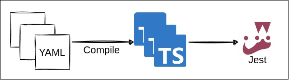

# How to Write Jest Scenarios in YAML
You can write tests in YAML, and Echoed will convert them into Jest tests.  

* [Compile](#compile)
* [Scenario](#scenario)
* [Common Features](#common-features)

## Compile
Executing `npx echoed compile` converts YAML files into Jest tests.



Note that, because each YAML file is transformed into a Jest test file, Jest runs tests  serially.

## Scenario

Tests converted from YAML is called `scenario`.  

You can create a scenario like below:
```yaml
variable:
  productId: OLJCESPC7Z
scenarios:
  - name: Get product detail
    steps:
      - description: fetch /products/{id}
        act:
          runner: fetch
          argument:
            endpoint: /products/${productId}
        assert:
          - expect(_.jsonBody.id).toBe(productId)
```

For more complex scenario, you can include additional options:
```yaml
retry: 3 # <- You can retry failed tests.
variable:
  productId: OLJCESPC7Z # <- You can define variables for corresponding scope.
  db: ${connectDB()} # <- You can call plugin with ${...}.
runners:
  - runner: fetch # <- You can override option of runners.
    option:
      baseEndpoint: ${_env.BASE_ENDPOINT}/api
      headers:
        content-type: application/json
hook:
  beforeEach: # <- You can run a function before each scenario. (beforeAll, afterEach, afterAll are available too.)
    - bind:
        productName: ${db.insertProduct()} # <- You can use `bind` in hook
  afterEach:
    - db.cleanup()
scenarios:
  - name: Adding item to cart
    variable:
      session: ${createSession()} # <- You can use the returned value of function or variable with ${...}.
    steps:
      - description: Add a product to cart
        arrange:
          - db.createUser(session.userId) # <- You can establish preconditions in `arrange`.
        act:
          runner: fetch # <- You can use built-in runner or create custom one. This `fetch` executes HTTP request to `/cart` with query.
          argument:
            endpoint: /cart?currencyCode=${session.currencyCode}
            method: POST
            jsonBody:
              item:
                productId: ${productId}
                quantity: 1
              userId: ${session.userId}
          option:
            baseEndpoint: ${_env.BASE_ENDPOINT}/api # <- You can reference environment variables defined in config with `_env`.
            headers:
              content-type: application/json
        assert:
          - assertStatus: # <- You can use built-in asserter or create custom one. This `assertStatus` checks the status code of the response.
            - ${_.response} # <- You can reference the result of `act` with `_` variable.
            - 200
          - expect(_.jsonBody.items.length).toBe(1)  # <- You can write Jest's assertion directly too.
          - |
            expect(_.jsonBody).toEqual({
              items: [ { productId, quantity: 1 } ],
              userId: session.userId,
            })
        bind:
          itemQuantity: ${_.jsonBody.items[0].quantity} # <- You can reference value outside step's scope with `bind`.
      - description: Check Span
        act:
          runner: waitForSpan # <- This built-in `waitForSpan` waits for the OpenTelemetry's span that matches the condition.
          argument:
            response: ${_steps[-1].response} # <- You can reference the result of previous step's act with `_steps` variable.
            filter:
              name: oteldemo.CartService/AddItem
              resource:
                attributes:
                  service.name: cartservice
              attributes:
                rpc.method: AddItem
        assert:
          - expect(_.getAttribute("app.product.quantity").value.intValue).toBe(itemQuantity)
```

For more examples, refer to [example/scenario](../create-echoed/template/jest/example/scenario) directory.

### Syntax

The essential elements of YAML include the following:

#### `variable`
**variable** can be defined at various places in YAML, serving the same purpose: "define variables and use them in corresponding scope".  
For instance, the following snippet defines `foo` variable with `123`(number):
```yaml
variable:
  foo: 123
```

Once variables are defined, you can use them as ordinal variables or in the middle of string by surrounding it with `${}`:

```yaml
argument:
  endpoint: /products/${foo} # <- string ("/products/123")
  myArg: ${foo} # <- number (123)
```

When you use `${}` within a string, it gets replaced with the value of the variable. 

#### `hook`
**hook** is used to define functions that are called before or after each scenario or whole scenarios in YAML.

#### `scenarios`
**scenarios** represent a collection of scenarios that define what tests are to be executed.   

Each `scenarios` comprises the following elements:

#### `scenarios.name`
**scenarios.name** specifies the name of the scenario.

#### `scenarios.steps`
**scenarios.steps** are used to define a collection of steps that specify the actions to be taken.

Each `scenarios.steps` in a scenarios consists of the following elements:

#### `scenarios.steps.arrange`
**scenarios.steps.arrange** is used to establish preconditions before `scenarios.steps.act`.

#### `scenarios.steps.act`
**scenarios.steps.act** defines the action the test performs, such as an HTTP request.

#### `scenarios.steps.assert`
**scenarios.steps.assert** is to compare the result of `scenarios.steps.act` with an expected value.  
You can use predefined asserter or write Jest's assertions directly.

#### `scenarios.steps.bind`
**scenarios.steps.bind** defines variables that can be used in subsequent steps.  
For example, you can store the result of `scenarios.steps.act`.

These are the primary elements of YAML, and this overview does not cover all elements.  
For a full list, refer to [jestScenarioYamlSchema.ts](../src/schema/jestScenarioYamlSchema.ts).

## Common Features

Refer to [scenario.md](./scenario.md) for common features.
