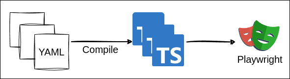

# How to Write Playwright Scenarios in YAML
You can write tests in YAML, and Echoed will convert them into Playwright tests.  

* [Compile](#compile)
* [Scenario](#scenario)
* [Common Features](#common-features)

## Compile
Executing `npx echoed compile` converts YAML files into Playwright tests.



Note that each YAML file is transformed into a Playwright test file.

## Scenario

Tests converted from YAML is called `scenario`.  

You can create a scenario like below:
```yaml
scenarios:
  - name: Validate Homepage
    fixtures:
      - page
    steps:
      - description: Check product list is shown
        act:
          raw: await page.goto("http://localhost:8080")
        assert:
          - expectToBeVisible: "[data-cy=home-page]"
          - expectToHaveCount:
              selector: "[data-cy=product-list] [data-cy=product-card]"
              count: 10
```

For more complex scenario, you can include additional options:
```yaml
retry: 3 # <- You can retry failed tests.
variable:
  db: ${connectDB()} # <- You can call plugin with ${...}.
use:
  baseURL: ${_env.BASE_ENDPOINT}  # <- You can change Playwright configuration per file. This is replaced to `test.use({...})`.
hook:
  beforeEach: # <- You can run a function before each scenario. (beforeAll, afterEach, afterAll are available too.)
    - bind:
        productName: ${db.insertProduct()} # <- You can use `bind` in hook
    - fixtures: # <- You can use fixtures in hook.
        - page
      raw: await page.goto("/") # <- You can use `raw` to run TypeScript as-is.
  afterEach:
    - db.cleanup()
scenarios:
  - name: Checkout Flow
    fixtures:
      - page
    variable:
      session: ${createSession()} # <- You can use the returned value of function or variable with ${...}.
    steps:
      - description: Add a product to cart
        arrange:
          - await page.locator("[data-cy=product-card]").first().click() # <- You can establish preconditions in `arrange`.
        act:
          raw: await page.locator("[data-cy=product-add-to-cart]").first().click() # <- You can use `raw` to run TypeScript as-is.
        assert: # <- You can use raw TypeScript or shorthand in `assert`. 
          - expectPageToHaveURL: "${/\/cart$/}"  # <- This is equivalent to `expect(page).toHaveURL(/\/cart$/);`.
          - expectToContainText:
              selector: "[data-cy=cart-item-count]"
              expected: "1"
      - description: Checkout
        act:
          raw: await page.locator("[data-cy=checkout-place-order]").click()
        assert:
          - expectPageToHaveURL: "${/\/checkout/}"
      - description: Check span is made by the request to checkout
        act:
          runner: waitForSpanCreatedIn  # <- This built-in `waitForSpanCreatedIn` waits for the OpenTelemetry's span that matches the condition.
          argument:
            context: ${page.context()}
            urlPattern: ${/api\/checkout/}
            filter:
              name:  "grpc.oteldemo.PaymentService/Charge"
              resource:
                attributes:
                  service.name: paymentservice
              attributes:
                rpc.method: Charge
        assert:
          - |
            const amountAttribute = _.getAttribute("app.payment.amount");
            expect(amountAttribute?.value?.doubleValue).toBe(120.749999999);
```

For more examples, refer to [example/scenario](../create-echoed/template/playwright/example/test/scenario) directory.

### Syntax

The essential elements of YAML include the following:

#### `variable`
**variable** can be defined at various places in YAML, serving the same purpose: "define variables and use them in corresponding scope".  
For instance, the following snippet defines `foo` variable with `123`(number):
```yaml
variable:
  foo: 123
```

Once variables are defined, you can use them as ordinal variables or in the middle of string by surrounding it with `${}`:

```yaml
argument:
  endpoint: /products/${foo} # <- string ("/products/123")
  myArg: ${foo} # <- number (123)
```

When you use `${}` within a string, it gets replaced with the value of the variable. 

#### `use`
**use** is used to override Playwright configuration in the file. `use` will be replaced to `test.use({...})` in the generated test file.

#### `hook`
**hook** is used to define functions that are called before or after each scenario or whole scenarios in YAML.

#### `scenarios`
**scenarios** represent a collection of scenarios that define what tests are to be executed.   

Each `scenarios` comprises the following elements:

#### `scenarios.name`
**scenarios.name** specifies the name of the scenario.

#### `scenarios.steps`
**scenarios.steps** are used to define a collection of steps that specify the actions to be taken.

Each `scenarios.steps` in a scenarios consists of the following elements:

#### `scenarios.steps.arrange`
**scenarios.steps.arrange** is used to establish preconditions before `scenarios.steps.act`.

#### `scenarios.steps.act`
**scenarios.steps.act** defines the action the test performs, such as clicking an element.

#### `scenarios.steps.assert`
**scenarios.steps.assert** is to compare the result of `scenarios.steps.act` with an expected value.  
You can use predefined asserter or write Jest's assertions directly.

#### `scenarios.steps.bind`
**scenarios.steps.bind** defines variables that can be used in subsequent steps.  
For example, you can store the result of `scenarios.steps.act`.

These are the primary elements of YAML, and this overview does not cover all elements.  
For a full list, refer to [playwrightScenarioYamlSchema.ts](../src/schema/playwrightScenarioYamlSchema.ts).

## Common Features

Refer to [scenario.md](./scenario.md) for common features.
