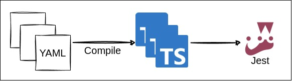

# How to Write Scenarios in YAML
You can write tests in YAML, and Echoed will convert them into Jest tests.  

* [Compile](#compile)
* [Scenario](#scenario)
* [Variable](#variable)
* [Configuration](#configuration)
* [Plugin](#plugin)

## Compile
Executing `npx echoed compile` converts YAML files into Jest tests.



Note that, because each YAML file is transformed into a corresponding Jest test file, Jest runs tests from the same YAML file serially within the same process.

## Scenario

Tests converted from YAML is called `scenario`.  

You can create a scenario like below:
```yaml
variable:
  productId: OLJCESPC7Z
scenarios:
  - name: Get product detail
    steps:
      - description: fetch /products/{id}
        act:
          runner: fetch
          argument:
            endpoint: /products/${productId}
        assert:
          - expect(_.jsonBody.id).toBe(productId)
```

For more complex scenario, you can include additional options:
```yaml
retry: 3 # <- You can retry failed tests.
variable:
  productId: OLJCESPC7Z # <- You can define variables for corresponding scope.
runners:
  - runner: fetch # <- You can override option of runners.
    option:
      baseEndpoint: ${_env.BASE_ENDPOINT}/api
      headers:
        content-type: application/json
scenarios:
  - name: Adding item to cart
    variable:
      session: ${createSession()} # <- You can use the returned value of function or variable with ${...}.
    steps:
      - description: Add a product to cart
        act:
          runner: fetch # <- You can use built-in runner or create custom one. This `fetch` executes HTTP request to `/cart` with query.
          argument:
            endpoint: /cart?currencyCode=${session.currencyCode}
            method: POST
            jsonBody:
              item:
                productId: ${productId}
                quantity: 1
              userId: ${session.userId}
          option:
            baseEndpoint: ${_env.BASE_ENDPOINT}/api # <- You can reference environment variables defined in config with `_env`.
            headers:
              content-type: application/json
        assert:
          - assertStatus: # <- You can use built-in asserter or create custom one. This `assertStatus` checks the status code of the response.
            - ${_.response} # <- You can reference the result of `act` with `_` variable.
            - 200
          - expect(_.jsonBody.items.length).toBe(1)  # <- You can write Jest's assertion directly too.
          - |
            expect(_.jsonBody).toEqual({
              items: [ { productId, quantity: 1 } ],
              userId: session.userId,
            })
        bind:
          itemQuantity: ${_.jsonBody.items[0].quantity} # <- You can reference value outside step's scope with `bind`.
      - description: Check Span
        act:
          runner: waitForSpan # <- This built-in `waitForSpan` waits for the OpenTelemetry's span that matches the condition.
          argument:
            response: ${_steps[-1].response} # <- You can reference the result of previous step's act with `_steps` variable.
            filter:
              name: oteldemo.CartService/AddItem
              resource:
                attributes:
                  service.name: cartservice
              attributes:
                rpc.method: AddItem
        assert:
          - expect(_.getAttribute("app.product.quantity").value.intValue).toBe(itemQuantity)
```

For more examples, refer to [example/scenario](../src/create/template/example/scenario) directory.

### Syntax

The essential elements of YAML include the following:

#### `variable`
**variable** can be defined at various places in YAML, serving the same purpose: "define variables and use them in corresponding scope".  
For instance, the following snippet defines `foo` variable with `123`(number):
```yaml
variable:
  foo: 123
```

Once variables are defined, you can use them as ordinal variables or in the middle of string by surrounding it with `${}`:

```yaml
argument:
  endpoint: /products/${foo} # <- string ("/products/123")
  myArg: ${foo} # <- number (123)
```

When you use `${}` within a string, it gets replaced with the value of the variable. 

#### `scenarios`
**scenarios** represent a collection of scenarios that define what tests are to be executed.   

Each `scenarios` comprises the following elements:

#### `name`
**scenarios.name** specifies the name of the scenario.

#### `steps`
**scenarios.steps** are used to define a collection of steps that specify the actions to be taken.

Each `steps` in a scenarios consists of the following elements:

#### `act`
**scenarios.steps.act** defines the action the test performs, such as an HTTP request.

#### `assert`
**scenarios.steps.assert** is to compare the result of `act` with an expected value.  
You can use predefined asserter or write Jest's assertions directly.

#### `bind`
**scenarios.steps.bind** defines variables that can be used in subsequent steps.  
For example, you can store the result of `act`.

These are the primary elements of YAML, and this overview does not cover all elements.  
For a full list, refer to [scenarioYamlSchema.ts](../src/schema/scenarioYamlSchema.ts).

## Variable

In YAML, there are several predefined variables that you can use:

* `_`: Represents the result of `act` in the current step.
* `_steps`: Represents the result of `act` in steps.  
  You can access it by index, for example, `_steps[-1]` or `_steps[2]`. A negative index indicates the relative position from the current step, while a positive index signifies the absolute position starting with zero.
* `_env`: Represents the environment variables defined in the configuration.

## Configuration

You can configure the behavior of the scenario by adding configuration like below at `.echoed.yml` file:

```yaml
scenario:
  compile:
    env:
      BASE_ENDPOINT: http://localhost:8080 # <- You can enable the lookup of environment variables with/without default values.
    plugin:
      runners:
        - name: fetch
          module: echoed/scenario/gen/jest/runner
          option:
            baseEndpoint: ${_env.BASE_ENDPOINT}/api # <- You can reference environment variables with `_env`.
            headers:
              content-type: application/json
      commons:  # <- You can import any module.
        - names:
            - createSession
          module: "@/example/util/session"
```
This configuration example does following:

* Sets the default value for the environment variable `BASE_ENDPOINT`.
* Sets the default options for the `fetch` runner.
* Imports `createSession` function from `@/example/util/session`.

For more detailed information, refer to [configSchema.ts](../src/schema/configSchema.ts).

## Plugin

To extend scenarios with additional functionalities, you can add functions at `plugin` section in the `.echoed.yml` file.  
There are three types of plugins: `Runner`, `Asserter` and `Common`.

* `Runner`  
    A function that is called inside `act`, typically performing actions like an HTTP request.  
    Its result is stored in the `_` variable. 
* `Asserter`  
  A function that is called inside `assert`, taking two arguments, typically for the expected and actual values. 

* `Common`  
  A function or variable that is usable anywhere except sections for `Runner` and `Asserter`.  
  Typically, it is called inside `${}`.

### Built-in Plugins

Some plugins are available by default.

Refer to [runner/index.ts](../src/scenario/gen/jest/runner/index.ts) and [asserter/index.ts](../src/scenario/gen/jest/asserter/index.ts) for a full list of plugins.  
If the name of built-in plugin collides with other plugin, the non-built-in plugin will take precedence.

### Custom Plugin

You can easily create custom plugins by creating function implementing corresponding interface and configure them in the `plugin` section.

* `Runner`  
  To create a custom runner, implement a function following the `Runner` interface in `echoed/scenario/gen/jest/runner`.  
  Here's an example:
  ```ts
  const myRunner = async (
    ctx: EchoedContext,
    argument: Argument,
    option: Option,
  ): Promise<Response> => {
    return await myFunction(argument);
  }
  ```
* `Asserter`  
  To create a custom asserter, implement a function following the `Asserter` interface in `echoed/scenario/gen/jest/asserter`.  
  Here's an example:
  ```ts
  const myAsserter = (
    ctx: unknown,
    expected: number,
    actual: number,
    option: Option,
  ): void => {
    expect(actual).toBe(expected);
  }
  ```

To use custom plugins, add them at the `plugin` section in `.echoed.yml` file.  
For instance, if you've created above plugins in `@/plugin`, configure them as follows:
```yaml
scenario:
  compile:
    plugin:
      runner:
        - name: myRunner
          module: "@/plugin"
      asserter:
        - name: myAsserter
          module: "@/plugin"
```
